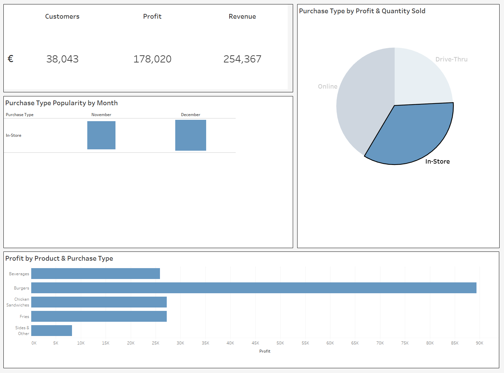

# Fast Food Data Analysis

## Contributors

<p align="center">
 <a href="https://github.com/cammcburney">Cameron McBurney</a> | <a href="https://github.com/lUKEdOWNEY">Luke Downey</a>
 </p>

 ## Project Overview

</p>
 <p align="left">
</p>

 This project involves transforming OLTP data into an OLAP format to optimise it for querying. Excel was used to clean data before inserting the rows into a PSQL database, the data was then extracted and transformed and uploaded to another PSQL database optimised for OLAP. The data was queried and visualised with both Excel and Tableau at the end of the process to provide insights and analysis of the contents.

- Data Cleaning and Initial Visualization:
    - Begin with uncleaned Excel files.
    - Perform necessary cleaning and preliminary visualizations directly in Excel.
- Data Transformation and Loading:
    - Convert cleaned Excel files to CSV format.
    - Utilize Python for loading CSV data into an OLTP PostgreSQL database.
- Data Structuring and Warehousing:
    - Transform the data into a star schema format.
    - Load the structured data into a dedicated data warehouse (OLAP).
- Data Distribution and Visualization:
    - Export warehouse data back into Excel spreadsheets.
    - Conduct detailed data analysis using SQL queries.
    - Create interactive dashboards and visualizations using Tableau for comprehensive data exploration.
- Reporting and Distribution:
    - Share finalized dashboards and reports with relevant stakeholders within the company or client organization.

This structured approach not only highlights our technical capabilities but also mirrors the practical challenges and outcomes expected in professional data management projects.


## Set-up

To setup this project you will need Postgres, Maketools, SQL and Python installed. The project requires a .env file in the following format to run sucessfully with a valid PSQL username and password:
```
db_user = <username>
db_password = <password>
db_host = localhost
db_port = 5432

db_name = 'oltpdatabase'
db_wname = 'olapwarehouse'

test_db_name = 'testoltpdatabase'
test_wh_name = 'testolapwarehouse'
```

1. Run the following command to set up your virtual environment and install required dependencies along with the databases required for querying and testing:

```
make requirements
```

2. Run this command next to set up security and coverage modules:

```
make dev-setup
```

3. Set up your `PYTHONPATH`:

```
export PYTHONPATH=$(pwd)
```

4. Run checks for unit-tests, pep8 compliancy, coverage and security vulnerabilities:

```
make run-checks
```

## Star-Schema

</p>
 <p align="left">
</p>

⦁	With our database structured in a star schema, querying is significantly more efficient, which in turn reduces performance costs.

⦁	The star schema's straightforward design makes it easier for users, especially those who are not deeply familiar with database design, to understand the relationships between the tables and the data stored in them.

⦁	With a star schema implemented, data can be stored in excel in cleaner and more manageable sheets.

## Interactive Dashboards

</p>
 <p align="left">
</p>

</p>
 <p align="left">
</p> 

⦁	Both of our Dashboards are live and interactive, by clicking on Product, Week or Country, it will dynamically change all the data to represent a chosen a filter and similarly, you can do the same on the second Dashboard.

⦁	Our designs are created with simplicity in mind, it is very clear and easy to retrieve valuable data and insights, while both can be easily modified and adjusted to add further requested features.

</p>
 <p align="left">
</p>

</p>
 <p align="left">
</p>
 
⦁	As demonstrated in the image above, selecting a product automatically updates all our data to reflect the chosen filter.

⦁	With filtering capabilities, targeting specific data is much more efficient than having multiple dashboards, although that is an option.

Extra Visualisations

## Product Revenue and Profit for November


```
with Quantity_By_Product as (
    select 
        m.city as City,
        m.country as Country,
        p.product as Product,
        SUM(f.quantity) as Total_Quantity,
        SUM(f.revenue) as Total_Revenue,
        SUM(f.profit) as Total_Profit,
        RANK() OVER (PARTITION BY m.city, m.country ORDER BY sum(f.quantity) DESC) as Quantity_Rank
    from 
        fact f
    join 
        manager m on f.manager_id = m.manager_id
    join 
        product p on f.product_id = p.product_id
    where 
        TO_DATE(f.date, 'DD/MM/YYYY') >= TO_DATE('01/11/2022', 'DD/MM/YYYY') 
        and TO_DATE(f.date, 'DD/MM/YYYY') < TO_DATE('01/12/2022', 'DD/MM/YYYY') 
    group by 
        m.city, m.country, p.product
)
select
    City,
    Country,
    Product,
    Total_Quantity,
    Total_Revenue,
    Total_Profit
from
    Quantity_By_Product
where
    Quantity_Rank = 1
```

</p>
 <p align="left">
</p>

## Profit Margin by Product

```
SELECT
    p.product_id,
    p.product,
    p.price,
    p.cost,
    (p."profit_unit" / p.price) * 100 AS profit_margin_percentage,
    p."profit_unit"
FROM
    product p
ORDER BY
    profit_margin_percentage DESC 
```

</p>
 <p align="left">
</p>